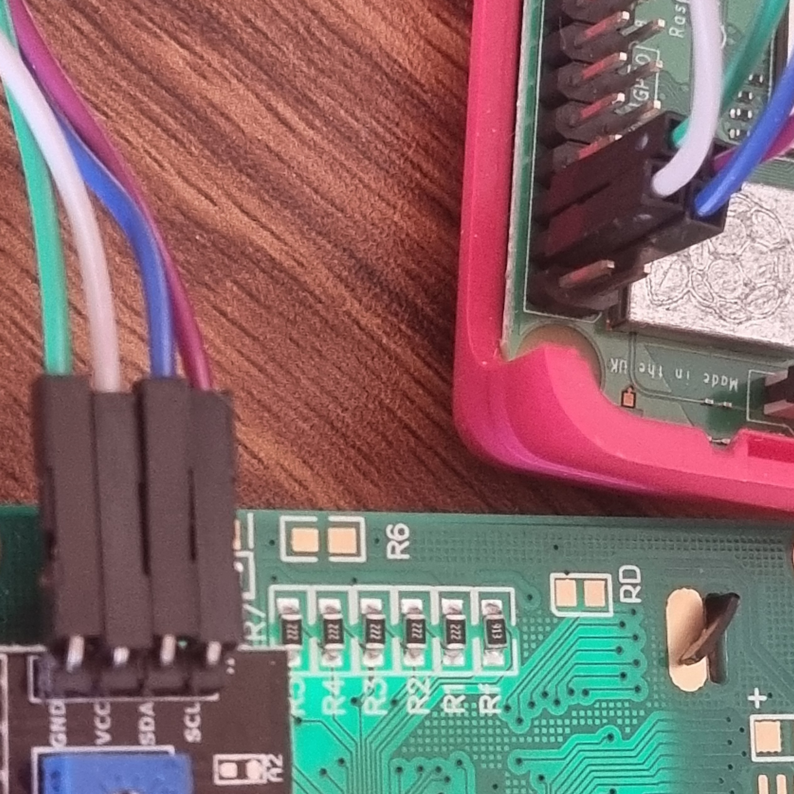

# *::: :B:itticka :::*
#### *raspi lcd bitcoin ticker*

This simple ticker connects to a [BitcoinExplorer](https://bitcoinexplorer.org) instance and displays some stats about the bitcoin network such as exchange rates, halving countdown, latest block, etc.


 

TODO (at some point if I get around to it): Setup RPC connection with BTC Core node and add a few extra info screens to the LCD.

## Required Components

- Raspberry pi + raspi OS installed (I used an old 3b I had kicking around but most pi's should work so long as they have internet capabilities. ie.pi3/4/5,zero w, etc.)
- 20x4 alphanumeric LCD with PCF8574 I2C expander (or you could do it without the expander but you'd need to figure out the extra wiring)
- 4 jumper cables to go from pi to the display
- A BitcoinExplorer instance to connect to (self hosted and connected to your own BTC Core node is recommended)

## Connect the display

Connecting a pi to a PCF8574 expander is simple and there are many tutorials online if the follwing simple outline is insufficient (eg. [here](https://www.circuitbasics.com/raspberry-pi-i2c-lcd-set-up-and-programming/) or [here](https://circuitdigest.com/microcontroller-projects/interfacing-lcd-with-raspberry-pi-4-to-create-custom-character-and-scrolling-text) )

There are only 4 pins on the LCD expander, each one needs to be connected to the pi in the following manor:

- SDA > SDA
- SCL > SCL
- GND > GND
- VCC > 5v



## Enable I2C
1) open raspi-config
```
sudo raspi-config
```
2) Select `Interface Options` and then make sure `I2c` is enabled


## Install i2c-tools and get LCD address

1) install tools
```
sudo apt-get install i2c-tools
```
2) reboot pi
3) find the address
```
sudo apt-get install i2c-tools
```
You should now see a table in which one cell contains a number. **Note this number down.**

```
     0  1  2  3  4  5  6  7  8  9  a  b  c  d  e  f
00:                         -- -- -- -- -- -- -- -- 
10: -- -- -- -- -- -- -- -- -- -- -- -- -- -- -- -- 
20: -- -- -- -- -- -- -- 27 -- -- -- -- -- -- -- -- 
30: -- -- -- -- -- -- -- -- -- -- -- -- -- -- -- -- 
40: -- -- -- -- -- -- -- -- -- -- -- -- -- -- -- -- 
50: -- -- -- -- -- -- -- -- -- -- -- -- -- -- -- -- 
60: -- -- -- -- -- -- -- -- -- -- -- -- -- -- -- -- 
70: -- -- -- -- -- -- -- --  
```

## Install other dependencies

```
sudo pip install RPLCD
```
```
sudo apt install python-smbus
```

## Clone this repo
```
git clone [this repo .git]
cd bitticka
```

## Configure

Copy `config.example.py` to `config.py` and open it for editing
```
sudo cp config.example.py config.py
sudo nano config.py
```
Change the LCD_ADDRESS to the one you noted down earlier, and change API_URL to your self hosted or preferred instance.
```
LCD_ADDRESS = 0x27

# URL of a bitcoin explore instance. No trailing slash.
API_URL = 'https://bitcoinexplorer.org'
```

## Test run
Whilst still in the bitticka dir run the script to make sure it's working.
```
python3 ./btcticker.py
```
You should now see the welcome screen appear

